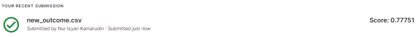
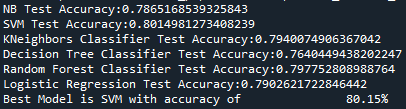
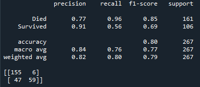

## Titanic Survival Prediction
I created a prediction model (Machine Learning pipeline) to predict the survival of titanic's passengers and a web application is created using Streamlit and Heroku.I also submitted the result (new_outcome.csv in datasets folder) on Kaggle and gained public score of 0.77751.

## Files Uploaded
This repository contains 4 python files (train.py, modules.py, deploy.py, app.py).

train.py contains the codes to extract the best machine learning model with the highest accuracy and train on train.csv dataset.
deploy.py contains the codes to deploy the machine learning model on test.csv.
modules.py contains modules and functions to deploy on train.py and test .py.
app.py contains the codes to build web app (streamlit).

## Model performance
1) Kaggle public score
# 

2) Machine learning pipelines model score
# 

3) Best model performance
# 

## Run Streamlit
1. Clone this repository.
2. Run streamlit via conda prompt by activating the correct environment and working directory and run the code "streamlit run app.py".
3. Your browser will automatically redirected to streamlit local host and the streamlit app can now be launched.
4. Insert your information and click "Submit" button to view the result.

## Web App
Please click [here](https://arcane-ridge-90775.herokuapp.com/) to view the Titanic survival prediction streamlit and insert your information then click "Submit" button to view the result.

## Credits
Big thanks to [towardsdatascience](https://towardsdatascience.com/deploying-a-basic-streamlit-app-to-heroku-be25a527fcb3) and [Bluecodes](https://www.youtube.com/watch?v=mQ7rGcE766k) for the guidance to deploy streamlit in heroku.
